# tarea4_modelos
Estudiante: Joseline Sánchez Solís (B77127)

En el siguiente repositorio se muestran los resultados de la tarea 4 del curso Modelos Probabilísticos de Señales y Sistemas. 

  Para la primera parte de esta tarea se solicitó crear un esquema BPSK. 
  En este caso se asigna una onda sinusoidal que está dada por la ecuación que se observa acontinuación y que cuenta con la forma 
de la señal mostrada: 

sinus = np.sin(2*np.pi * f * tp)

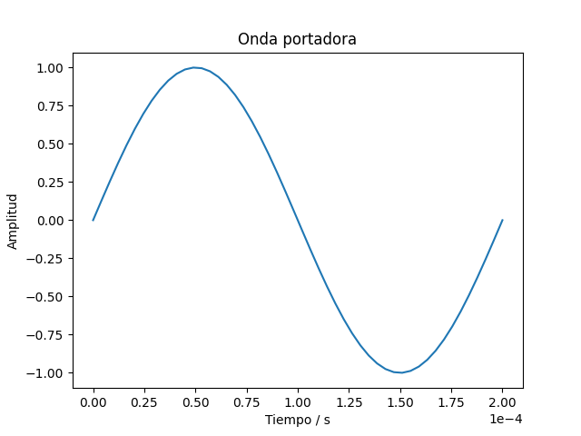

  Debido a que se trabaja con una modulación BPSK entonces debe asignarse la onda sinus cuando el bit es 1 y -sinus cuando el 
bit es 0, de forma que ante los primeros 10 bits se obtiene la siguiente señal: 

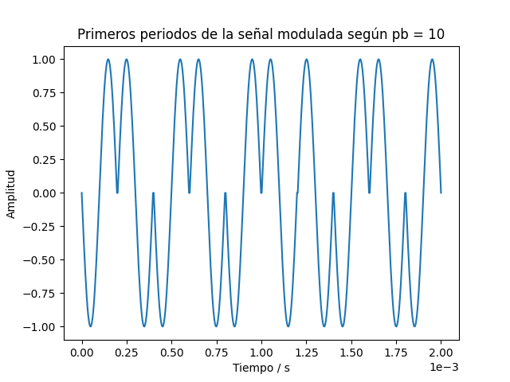

  El siguiente punto fue el cálculo de la potencia de la señal modulada. Esta se calcula como la integral desde T hasta -T de la 
potencia instantánea (senus^2), dividido entre dos veces el periodo (T). El resultado obtenido fue 0.4900009800019598. 

  Por otro lado, se tiene que la densidad esprectral transmitida es la siguiente:
  
  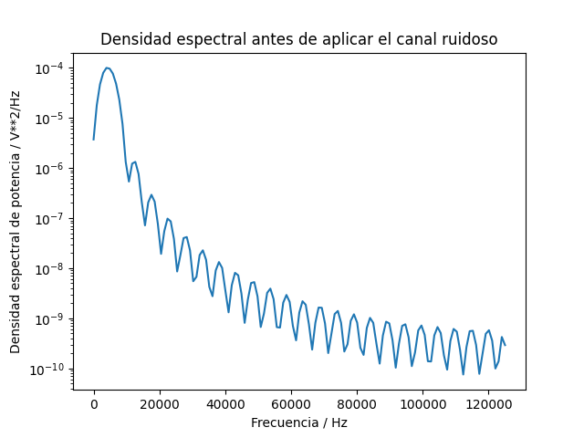

  Una vez que se obtiene este valor, se aplica ruido AWGN (ruido aditivo blanco gaussiano) a la señal de manera que se pueda estudiar 
el concepto de SNR (Signal-to-noise ratio), este concepto es la relación, en decibeles, entre la señal y el ruido, dicha ecuación 
se muestra a continuación:
  
  SNR = 10log(Ps/Pn)
  
  Donde Ps es la potencia de la señal modulada y Pn es la potencia del ruido. Como ya se verá más adelante, se obtienen más errores 
en la demodulación entre más negativo sea el SNR, esto quiere decir que cuando Ps/Pn<1 entonces la potencia del ruido es mayor 
respecto a la potencia de la señal por lo que, para obtener una mejor demodulación, es necesario reducir el umbral. Cuando la potencia 
de la señal es mayor entonces es más fácil "ignorar" el ruido. A continuación se muestran la señal que el recibida para valores de SNR 
que van desde -2dB hasta 3dB.

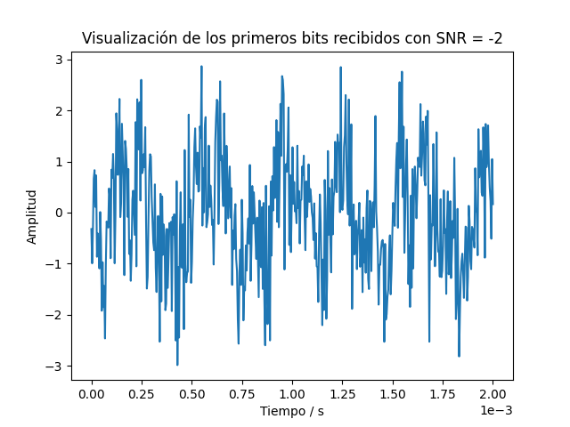
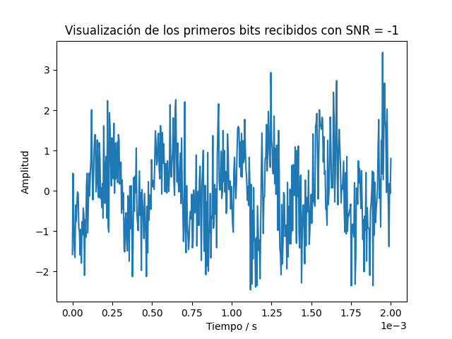
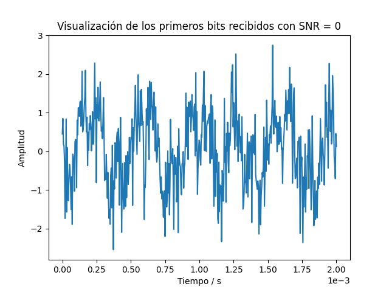
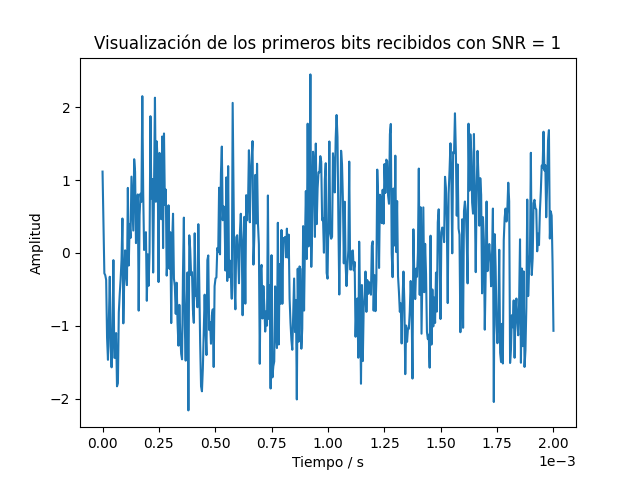
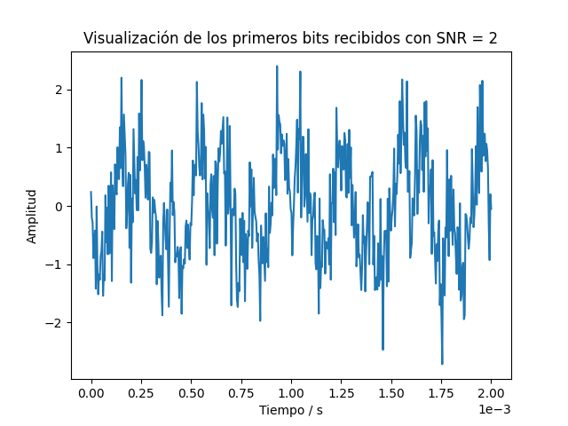
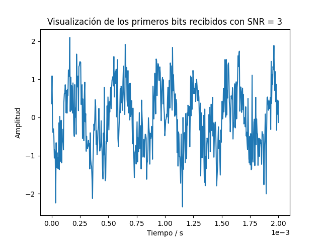

  Respecto a la densidad espectral recibida después de aplicar el ruido se obtiene lo siguiente para cada nivel de SNR:
  
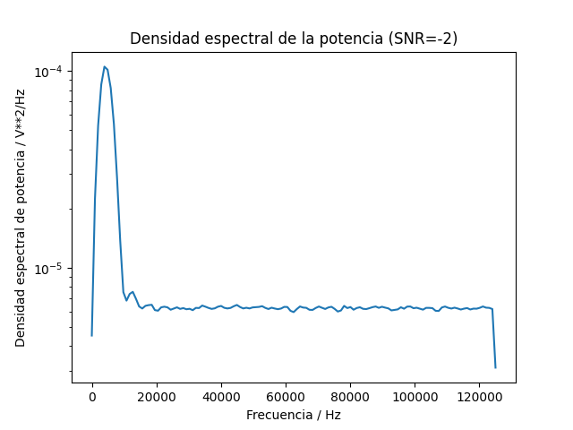

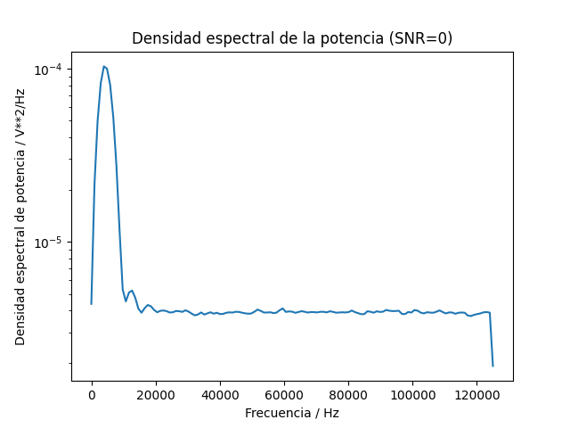
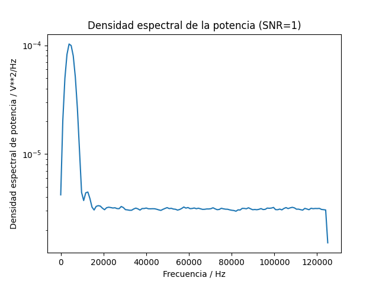
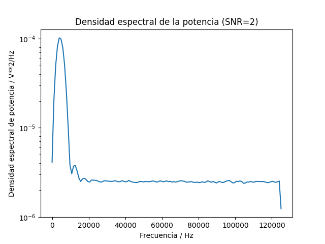
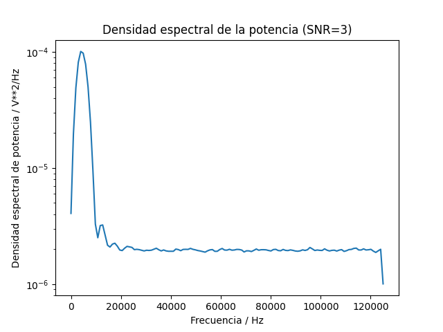

  Para demodular y decodificar las señales, se utilizó un umbral definido por Ep>Es/2. En la imagen que se muestra a continuación 
se puede ver una gráfica de los errores respecto al nivel SNR.

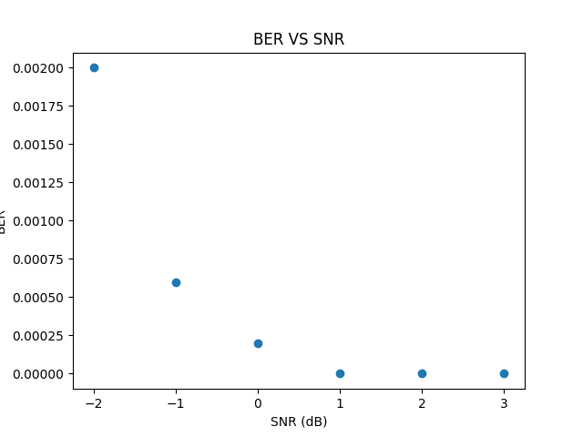

  Se puede observar que para SNR=-2dB se obtiene un error de 0.002, este error puede variar pues se utiliza el comando np.random.normal() 
para crear el ruido. Es el error más grande obtenido. Si volvemos a la ecuación de SNR y se despeja la relación Ps/Pn, se consigue 
un valor de 0.631, mientras que para SNR=2dB se tiene que Ps/Pn=1.58. De estos despejes se concluye que para -2dB la potencia del ruido 
es significativamente mayor respecto a la potencia de la señal por lo que el umbral elegido no es suficiente para "interpretar" la 
totalidad de los bits recibido. Se tiene el caso contrario cuando el nivel de SNR es 2dB, pues Ps supera a Pn, lo que genera cierta facilidad 
para identificar los bits de la señal ruidosa.

  Durante el análisis de los resultados se intentaron con distintos umbrales; cuando Ep>Es/6 se consigue que para todos lo niveles se 
obtenga un error de 0.
